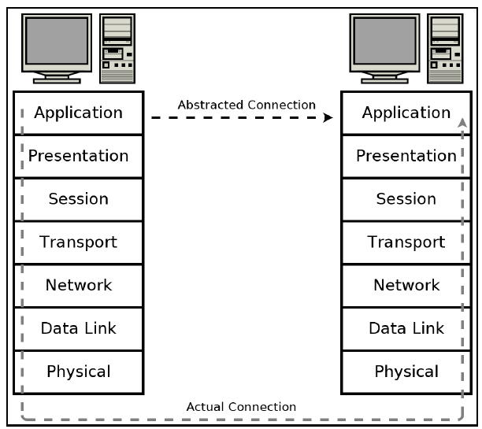
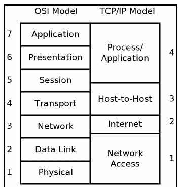

# <center>Introduction</center> 
- Networking -> connecting various digital device to communicate and to share resources. 
- Protocols -> Standards define to communicate over internet.\
                 e.g. - voltage in ethernet, how jpeg compressed to show on web page.
-While communication, many problems arises as in whom to send , what method  use to send , error correction , etc.
- These questions are treated as problems in communication and each of it is dealt at different layer.
- The way all these layers are dealt and defined as a whole structure is called a network model.

## OSI(Open System Interconnection) model
- standardized in 1977, published in ISO 7498(International Organization for Standardization)
- Layers in OSI model 

| Layer name | Functions |
|------------|-----------|
|Application layer | User interface e.g -> web browser, email services etc. |
|Presentation layer | Defining data structure, Encoding, Encryption, data representation| 
| Session layer | Establishing, Suspend, Resume, Checkpoints terminal dialogs |
| Transport layer | Provide TCP/UDP, Splitting of data, Recombining them, orders of data packets, also responsible for process to process delivery |
| Network layer | Transmit the data between node and network. Here IP(Internet protocol) is defined |
| Data Link layer | Deals with the protocol, Define how a direct message between two nodes, framing, error detection/correction |
| Physical layer | Deals with the real world transmission hardware specification e.g. -> voltage in ethernet cable, frequency of wifi, flashes over an optical fiber|


 
 >> **NOTE:**\
    Chunks are called :
    1. Frame -> At data link layer 
    2. packet -> At Network layer
    3. Segment -> At Transport layer(TCP)
    4. Datagram -> AT Transport layer(UDP) 

## TCP/IP(Transmission Control Protocol/Internet Protocol) Layer model
- The TCP/IP model is a conceptual model that describes how data is transmitted over a network, and it is widely used as the basis for modern communication networks.

> **🖊️** -> TCP/IP reference model was developed after the TCP/IP protocols already in common use. 

```
🔷
The OSI model is better for understanding and reasoning about networking concerns, but the TCP/IP model reflects a more realistic view of how networking is commonly implemented today.
```
- Layers

| Layer Name | Function |
|------------|----------|
|Network Access layer | Physical connection, data framing, sending ethernet or wifi packets |
|Internet layer | Addressing packets and routing them over the network, this is where IP addresses are defined |
|Host-to-Host layer | Provide protocols(e.g. -> UDP, TCP), data order, data segmentation, network congestion, error detection/correction |
| Process/Application layer | Here protocols are implemented(e.g. -> SMTP, FTP, HTTP, etc.), user interface|

> Lower level provided by operating system we work mostly in Process/Application layer




